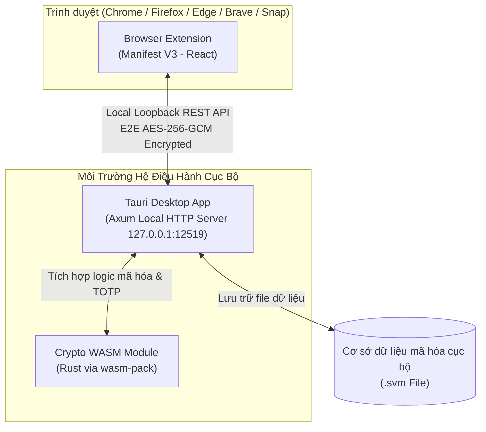

# Secure Vault Manager (SVM)

<div align="center">
  
  
  <p><strong>Ứng dụng quản lý kho lưu trữ mật khẩu cá nhân ngoại tuyến an toàn, bảo mật và tiện lợi.</strong></p>

[](https://tauri.app)
[](https://react.dev)
[](https://www.rust-lang.org)
[](https://webassembly.org)

[](https://nodejs.org)
[](https://pnpm.io)
[](#)
[](./LICENSE)

[](https://github.com/prettier/prettier)
[](https://makeapullrequest.com)

</div>

---

## 📖 Giới Thiệu

**Secure Vault Manager (SVM)** là một hệ thống quản lý mật khẩu cá nhân mã nguồn mở, hoạt động hoàn toàn ngoại tuyến (**100% Offline & Self-custody**). SVM được thiết kế để mang lại mức độ bảo mật tối đa cho dữ liệu nhạy cảm của bạn, đồng thời cung cấp trải nghiệm tự động điền mật khẩu mượt mà trên trình duyệt thông qua một kiến trúc tích hợp chặt chẽ giữa ứng dụng Desktop và Browser Extension.

SVM kết hợp sức mạnh hiệu năng và độ tin cậy của **Rust**, tính linh hoạt của **WebAssembly** trong mã hóa phía máy khách, và giao diện người dùng hiện đại, tinh tế được dựng bằng **React** và **Mantine v9**.

---

## 🏗️ Kiến Trúc Hệ Thống

SVM sử dụng kiến trúc Monorepo chia làm nhiều thành phần phối hợp chặt chẽ với nhau:



---

## ✨ Tính Năng Nổi Bật

- **Mã Hóa Đẳng Cấp Quân Sự (Military-Grade Encryption)**: Sử dụng các thuật toán mã hóa hiện đại nhất (PBKDF2/Argon2 phái sinh khóa và AES-256-GCM mã hóa đối xứng với 12-byte random IV) thông qua module Rust biên dịch sang WebAssembly cực nhanh và an toàn.
- **Không Lưu Trữ Đám Mây (Zero-Cloud & Zero-Knowledge)**: Dữ liệu của bạn thuộc về bạn. Mọi thông tin đều được mã hóa cục bộ trên máy tính của bạn trước khi ghi xuống đĩa cứng. Không có máy chủ trung gian, không lo rò rỉ dữ liệu.
- **Tích Hợp Trình Duyệt Tiện Lợi (Browser Integration)**: Tự động điền (autofill) tài khoản và mật khẩu trực tiếp trên các trang web thông qua Browser Extension, giao tiếp an toàn tuyệt đối với ứng dụng Desktop qua giao thức **Local Loopback REST API (100% tương thích Linux Snap & Flatpak)**.
- **Giao Diện Hiện Đại & Cao Cấp (Premium UI/UX)**: Trải nghiệm mượt mà với thiết kế Dark Mode khí quyển, phối màu HSL tinh tế đồng bộ giữa Desktop App và Extension, tương tác linh hoạt với các hiệu ứng micro-animations.
- **Đa Ngôn Ngữ (i18n)**: Hỗ trợ chuyển đổi nhanh chóng giữa Tiếng Việt và Tiếng Anh trên cả giao diện và menu khay hệ thống (System Tray).
- **Tự Động Khóa Thông Minh (Auto-Lock)**: Tự động khóa kho lưu trữ và giải phóng khóa mật mã khỏi bộ nhớ khi ứng dụng bị ẩn hoặc đóng xuống khay hệ thống, ngăn chặn các cuộc tấn công trích xuất bộ nhớ.

---

## 📦 Cơ Cấu Monorepo

Dự án được cấu trúc dưới dạng Monorepo sử dụng **pnpm workspaces** và **Cargo workspaces**:

- [packages/desktop](packages/desktop): Ứng dụng Desktop chính chạy trên nền tảng Tauri v2, giao diện React + Mantine v9, tích hợp Axum Local HTTP Server (`127.0.0.1:12519`).
- [packages/extension](packages/extension): Browser Extension (Manifest V3) hỗ trợ tự động điền mật khẩu, quét 2FA QR code, tạo gợi ý lưu tài khoản.
- [packages/crypto-wasm](packages/crypto-wasm): Thư viện mã hóa & TOTP generator viết bằng Rust biên dịch sang WebAssembly để sử dụng ở cả Desktop và Extension.
- [packages/shared](packages/shared): Định nghĩa các kiểu dữ liệu TypeScript dùng chung và các hàm wrapper mã hóa WebAssembly.

---

## 🚀 Thiết Lập Phát Triển Nhanh

Chi tiết từng bước cấu hình môi trường được mô tả chi tiết tại [DEVELOPMENT.md](DEVELOPMENT.md). Dưới đây là tóm tắt nhanh:

### Yêu cầu hệ thống

- **Node.js** (Phiên bản `>= 18.0.0`)
- **pnpm** (Phiên bản `>= 8.0.0`)
- **Rust Toolchain** (Biên dịch Rust backend)
- **wasm-pack** (Biên dịch crypto sang WASM)
- Các dependencies của Tauri (Xem [Tauri Prerequisites](https://tauri.app/start/prerequisites/))

### Cài đặt và Khởi tạo

1. Cài đặt các thư viện Node.js:

   ```bash
   pnpm install
   ```

2. Biên dịch module WebAssembly mã hóa:

   ```bash
   pnpm run build:wasm
   ```

3. Khởi chạy **Tauri Desktop**:

   ```bash
   pnpm dev:desktop
   ```

4. Biên dịch **Browser Extension**:

   ```bash
   pnpm --filter extension build
   ```

---

## 🤝 Hướng Dẫn Đóng Góp

Chúng tôi luôn chào đón mọi sự đóng góp từ cộng đồng! Vui lòng tham khảo [CONTRIBUTING.md](CONTRIBUTING.md) để biết thêm về:

1. **Quy trình đặt tên nhánh (Git Branching)**: Tuân thủ định dạng `<type>/<scope>/<mô-tả-ngắn>` (ví dụ: `feature/desktop/add-vault-locking-timer`).
2. **Quy chuẩn Commit (Conventional Commits)**: Định dạng `<type>(<scope>): <mô tả>` (ví dụ: `feat(desktop): implement idle auto lock`).
3. **Tiêu chuẩn Chất Lượng Mã Nguồn**:
   - Chạy `pnpm lint` và `pnpm format` đối với mã nguồn Frontend.
   - Chạy `cargo check` đối với mã nguồn Rust.

---

## 📄 Giấy Phép & Bản Quyền

Dự án này được phân phối dưới giấy phép **MIT License**. Chi tiết xem tại tệp tin [LICENSE](LICENSE).

Bản quyền © 2026 thuộc về **Hai Pham Ngoc** (<ngochai285nd@gmail.com>).
