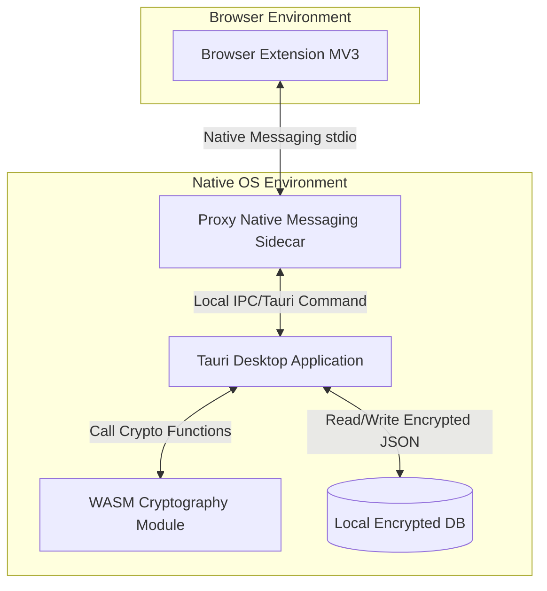

# TÀI LIỆU TẢC TẢ YÊU CẦU HỆ THỐNG (SRS) - SECURE VAULT MANAGER (SVM)

## 1. Giới Thiệu (Introduction)

### 1.1. Mục Đích (Purpose)

Tài liệu Đặc tả Yêu cầu Hệ thống (SRS) này mô tả chi tiết các yêu cầu kỹ thuật, chức năng và phi chức năng cho dự án **Secure Vault Manager (SVM)**. Tài liệu được thiết kế nhằm làm cơ sở phát triển mã nguồn, kiểm thử hệ thống và bàn giao sản phẩm.

### 1.2. Phạm Vi Tài Liệu (Document Scope)

Đặc tả này áp dụng cho toàn bộ kiến trúc Monorepo của SVM, bao gồm bốn cấu phần (packages) chính:

- **Ứng dụng Desktop (Tauri + React)**
- **Browser Extension (Manifest V3)**
- **Proxy Native Messaging Sidecar (Rust)**
- **Thư viện mã hóa WebAssembly (Rust -> WASM)**

### 1.3. Định Nghĩa & Viết Tắt (Definitions & Acronyms)

| Thuật ngữ   | Định nghĩa                                                                 |
| :---------- | :------------------------------------------------------------------------- |
| **SVM**     | Secure Vault Manager                                                       |
| **WASM**    | WebAssembly                                                                |
| **CSP**     | Content Security Policy (Chính sách bảo mật nội dung)                      |
| **IPC**     | Inter-Process Communication (Giao tiếp liên tiến trình)                    |
| **AES-GCM** | Advanced Encryption Standard in Galois/Counter Mode (Mã hóa đối xứng mạnh) |
| **KDF**     | Key Derivation Function (Hàm dẫn xuất khóa mật khẩu)                       |

---

## 2. Mô Tả Tổng Quan (Overall Description)

### 2.1. Kiến Trúc Hệ Thống (System Architecture)

Hệ thống hoạt động theo cơ chế ngoại tuyến (offline-first), các cấu phần tương tác cục bộ với nhau thông qua luồng dữ liệu bảo mật:



### 2.2. Các Tác Nhân Hệ Thống (System Actors)

- **Người dùng cuối (End User):** Tương tác với ứng dụng Desktop để quản lý mật khẩu và sử dụng Extension để điền tự động trên trình duyệt.
- **Trình duyệt Web (Web Browser):** Đóng vai trò môi trường chạy của Extension và điều phối thông điệp Native Messaging qua cổng `stdio`.

### 2.3. Ràng Buộc & Giả Định (Constraints & Assumptions)

- Người dùng phải cài đặt và khởi chạy ứng dụng Desktop để có thể kết nối hoàn chỉnh với Browser Extension.
- Môi trường chạy yêu cầu các thư viện hệ thống cần thiết (đặc biệt là GStreamer trên Linux và WebView2 trên Windows).

---

## 3. Yêu Cầu Chức Năng Chi Tiết (Detailed Functional Requirements)

### 3.1. Phân Hệ Ứng Dụng Desktop (Desktop App)

- **FR-DESK-01 (Quản lý Master Password):**
  - Hệ thống yêu cầu người dùng thiết lập Master Password trong lần chạy đầu tiên.
  - Cho phép thay đổi Master Password (yêu cầu nhập Master Password cũ).
- **FR-DESK-02 (Quản lý kho dữ liệu - CRUD Items):**
  - Thêm, sửa, xóa các loại tài khoản đăng nhập (Tên đăng nhập, Mật khẩu, Website, Ghi chú).
  - Thêm, sửa, xóa thẻ thanh toán (Tên chủ thẻ, Số thẻ, Ngày hết hạn, mã CVV).
  - Thêm, sửa, xóa ghi chú mật bảo mật.
- **FR-DESK-03 (Tìm kiếm & Bộ lọc):**
  - Tìm kiếm nhanh tức thời theo tiêu đề, tên tài khoản hoặc tên miền website.
- **FR-DESK-04 (Tự động khóa):**
  - Hỗ trợ cấu hình thời gian nhàn rỗi (ví dụ: 5 phút, 15 phút). Khi hết giờ, ứng dụng tự động xóa khóa phiên giải mã và hiển thị màn hình khóa.

### 3.2. Phân Hệ Thư Viện Mã Hóa WebAssembly (WASM Cryptography)

- **FR-WASM-01 (Dẫn xuất khóa - Key Derivation):**
  - Sử dụng thuật toán **Argon2id** để chuyển đổi Master Password thành Master Key.
  - Cấu hình đề xuất: `Memory: 64MB`, `Iterations: 3`, `Parallelism: 4`.
- **FR-WASM-02 (Mã hóa dữ liệu):**
  - Sử dụng thuật toán **AES-256-GCM** để mã hóa kho dữ liệu JSON.
  - Mỗi lần mã hóa phải sử dụng một IV (Initialization Vector) ngẫu nhiên dài 96-bit (12 bytes).
  - Đầu ra mã hóa có cấu trúc: `IV (12 bytes) || Ciphertext || Auth Tag (16 bytes)`.

### 3.3. Phân Hệ Browser Extension (Manifest V3)

- **FR-EXT-01 (Nhận diện trang web):**
  - Tự động lấy tên miền (domain) của tab hiện tại trên trình duyệt.
- **FR-EXT-02 (Yêu cầu thông tin tài khoản):**
  - Gửi yêu cầu truy vấn tài khoản tương ứng với domain hiện tại tới Proxy.
- **FR-EXT-03 (Autofill):**
  - Điền tự động tên đăng nhập và mật khẩu vào form trên trang web sau khi người dùng xác nhận trên Popup.

### 3.4. Phân Hệ Native Messaging Proxy (Sidecar)

- **FR-PROXY-01 (Chuyển tiếp thông điệp):**
  - Nhận luồng tin nhắn byte-stream từ trình duyệt qua `stdio`, phân tích thành JSON và chuyển tiếp tới Desktop App.
  - Đảm bảo cơ chế đóng gói tin nhắn gồm 4 byte chỉ độ dài (Native Byte Order) đi kèm với Payload JSON.

---

## 4. Giao Diện Bên Ngoài & Giao Thức (External Interfaces & Protocols)

### 4.1. Giao Diện Người Dùng (UI)

- Ứng dụng Desktop sử dụng **Mantine V9** hỗ trợ đầy đủ Dark Mode/Light Mode.
- Giao diện thiết kế theo chuẩn Responsive:
  - Máy tính / Desktop: Layout sidebar cố định.
  - Mobile (Thiết bị di động): Menu rút gọn dạng Burger/Drawer.

### 4.2. Giao Thức Truyền Thông (Native Messaging Protocol)

Giao tiếp giữa Browser Extension và Proxy Sidecar sử dụng luồng byte-stream chuẩn của trình duyệt:

#### Định dạng tin nhắn gửi từ Extension

```json
{
  "action": "get_credentials",
  "domain": "github.com"
}
```

#### Định dạng tin nhắn phản hồi từ Proxy

```json
{
  "status": "success",
  "data": [
    {
      "id": "item_01",
      "username": "haiphamngoc_dev",
      "password": "encrypted_password_hash"
    }
  ]
}
```

---

## 5. Yêu Cầu Phi Chức Năng (Non-Functional Requirements)

### 5.1. Yêu Cầu Bảo Mật (Security)

- **Mã hóa bộ nhớ (Memory Security):** Không giữ Master Password dưới dạng Cleartext trong bộ nhớ RAM sau khi đã dẫn xuất khóa thành công.
- **Chính sách nội dung (CSP):** Browser Extension bắt buộc phải khai báo cấu hình `"extension_pages": "script-src 'self' 'wasm-unsafe-eval'"` để cho phép chạy WebAssembly mà không vi phạm quy định bảo mật của Manifest V3.
- **Xác thực Proxy:** Chỉ cho phép kết nối từ Extension ID hợp lệ được cấu hình trước trong danh sách `allowed_origins`.

### 5.2. Hiệu Năng & Tài Nguyên (Performance & Capacity)

- Thời gian phản hồi điền mật khẩu từ khi nhấn nút tới khi hiển thị trên form trang web không quá `150ms`.
- Dung lượng bộ nhớ RAM của file thực thi proxy chạy nền tối đa `15MB`.
