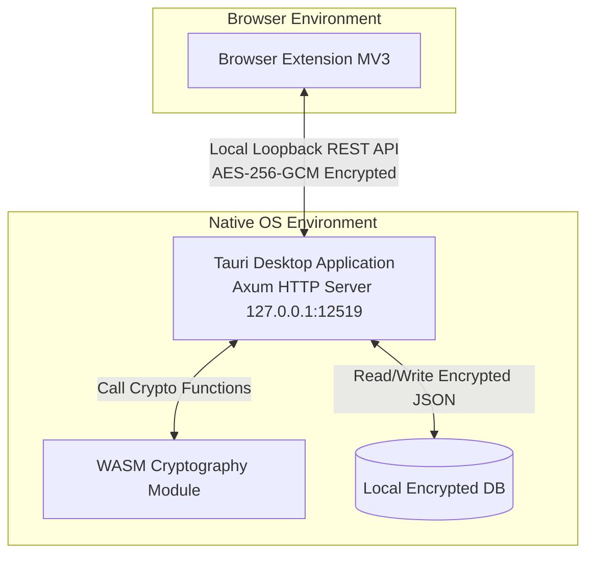

# TÀI LIỆU ĐẶC TẢ YÊU CẦU HỆ THỐNG (SRS) - SECURE VAULT MANAGER (SVM)

## 1. Giới Thiệu (Introduction)

### 1.1. Mục Đích (Purpose)

Tài liệu Đặc tả Yêu cầu Hệ thống (SRS) này mô tả chi tiết các yêu cầu kỹ thuật, chức năng và phi chức năng cho dự án **Secure Vault Manager (SVM)**. Tài liệu được thiết kế nhằm làm cơ sở phát triển mã nguồn, kiểm thử hệ thống và bàn giao sản phẩm.

### 1.2. Phạm Vi Tài Liệu (Document Scope)

Đặc tả này áp dụng cho toàn bộ kiến trúc Monorepo của SVM, bao gồm các cấu phần (packages) chính:

- **Ứng dụng Desktop (Tauri V2 + React + Mantine v9 + Axum HTTP Server)**
- **Browser Extension (Manifest V3 - Chrome & Firefox)**
- **Thư viện mã hóa WebAssembly (Rust -> WASM)**

### 1.3. Định Nghĩa & Viết Tắt (Definitions & Acronyms)

| Thuật ngữ     | Định nghĩa                                                                              |
| :------------ | :-------------------------------------------------------------------------------------- |
| **SVM**       | Secure Vault Manager                                                                    |
| **WASM**      | WebAssembly                                                                             |
| **AES-256-GCM** | Advanced Encryption Standard mit Galois/Counter Mode (Mã hóa đối xứng E2E kèm xác thực) |
| **E2E**       | End-to-End Encryption (Mã hóa đầu-cuối)                                                 |
| **CSP**       | Content Security Policy (Chính sách bảo mật nội dung)                                   |
| **IPC**       | Inter-Process Communication (Giao tiếp liên tiến trình qua REST API Local Loopback)     |

---

## 2. Mô Tả Tổng Quan (Overall Description)

### 2.1. Kiến Trúc Hệ Thống (System Architecture)

Hệ thống hoạt động theo cơ chế ngoại tuyến (offline-first), các cấu phần tương tác cục bộ với nhau thông qua luồng dữ liệu bảo mật E2E:



### 2.2. Các Tác Nhân Hệ Thống (System Actors)

- **Người dùng cuối (End User):** Tương tác với ứng dụng Desktop để quản lý mật khẩu và sử dụng Extension để điền tự động trên trình duyệt.
- **Trình duyệt Web (Web Browser):** Đóng vai trò môi trường chạy của Extension, hỗ trợ gọi REST API `http://127.0.0.1:12519`.

---

## 3. Yêu Cầu Chức Năng Chi Tiết (Detailed Functional Requirements)

### 3.1. Phân Hệ Ứng Dụng Desktop (Desktop App)

- **FR-DESK-01 (Axum Local HTTP Server):**
  - Khởi chạy REST HTTP Server ngầm tại `127.0.0.1:12519` (với các cổng dự phòng `12520`, `12521`).
  - Cung cấp route `GET /status` kiểm tra trạng thái và route `POST /rpc` nhận payload mã hóa E2E AES-256-GCM.
- **FR-DESK-02 (Quản lý Master Password):**
  - Hệ thống yêu cầu người dùng thiết lập Master Password trong lần chạy đầu tiên.
- **FR-DESK-03 (Quản lý kho dữ liệu - CRUD Items):**
  - Thêm, sửa, xóa tài khoản đăng nhập (Username, Password, Website, TOTP Secret, Notes).
  - Thêm, sửa, xóa thẻ thanh toán và ghi chú mật.
- **FR-DESK-04 (Tự động khóa):**
  - Hỗ trợ cấu hình thời gian nhàn rỗi. Khi hết giờ, ứng dụng tự động xóa khóa phiên giải mã và hiển thị màn hình khóa.

### 3.2. Phân Hệ Thư Viện Mã Hóa WebAssembly (WASM Cryptography)

- **FR-WASM-01 (Mã hóa dữ liệu & TOTP):**
  - Mã hóa kho dữ liệu bằng PBKDF2/Argon2 + AES-GCM/ChaCha20-Poly1305.
  - Biên dịch Rust TOTP generator sang WASM phục vụ sinh mã 2FA trực tiếp trong Extension và Desktop.

### 3.3. Phân Hệ Browser Extension (Manifest V3)

- **FR-EXT-01 (Xác thực Pairing Token tức thì):**
  - Thực hiện xác thực Pairing Token mã hóa E2E ngay khi dán/quét mã bắt cặp và khi mở Popup.
  - Tự động gỡ bỏ token và đưa về màn hình Setup nếu token bị thay đổi trên Desktop App.
- **FR-EXT-02 (Nhận diện & Autofill Smart Dropdown):**
  - Phân loại thông minh trường input và hiển thị duy nhất 1 dropdown gợi ý autofill với cơ chế debouncing Request ID.
- **FR-EXT-03 (Quét 2FA QR Code):**
  - Quét ảnh màn hình tab hiện tại để trích xuất `otpauth://` URI và tự động cập nhật secret vào Desktop Vault.

---

## 4. Giao Diện Bên Ngoài & Giao Thức (External Interfaces & Protocols)

### 4.1. Giao Diện Người Dùng (UI)

- Ứng dụng Desktop và Extension đồng bộ 100% bảng màu Dark Mode:
  - Deep Abyss: `#070a13`
  - Midnight Navy: `#0e1324`
  - Steel Shield: `#171e35`
  - Text Primary High-Contrast: `#f8fafc`

### 4.2. Giao Thức Truyền Thông (E2E AES-256-GCM RPC Protocol)

Giao tiếp giữa Browser Extension và Axum Local HTTP Server:

#### Request POST /rpc Payload Encrypted Structure

```json
{
  "pairing_token": "string",
  "ciphertext": "base64_string",
  "nonce": "base64_string_12_bytes"
}
```

---

## 5. Yêu Cầu Phi Chức Năng (Non-Functional Requirements)

### 5.1. Yêu Cầu Bảo Mật (Security)

- **Mã hóa bộ nhớ (Memory Security):** Không giữ Master Password dưới dạng Cleartext trong bộ nhớ RAM sau khi đã dẫn xuất khóa thành công.
- **End-to-End Payload Encryption:** Mọi gói tin truyền qua `127.0.0.1` đều được mã hóa bằng AES-256-GCM với chìa khóa derive từ SHA-256(Pairing Token) và 12-byte IV ngẫu nhiên riêng biệt cho từng request.

### 5.2. Hiệu Năng & Tài Nguyên (Performance & Capacity)

- Thời gian phản hồi điền mật khẩu từ Extension đến Desktop App qua Local HTTP REST API nhỏ hơn `3ms`.
